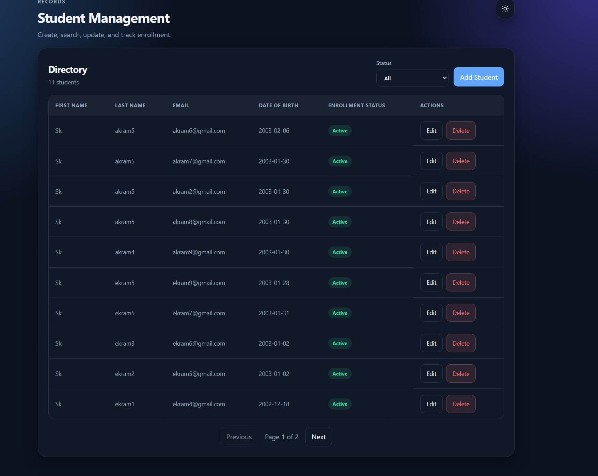
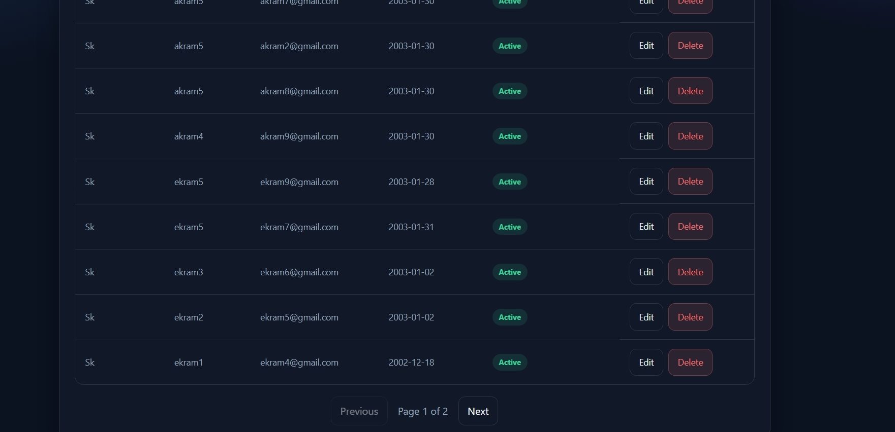
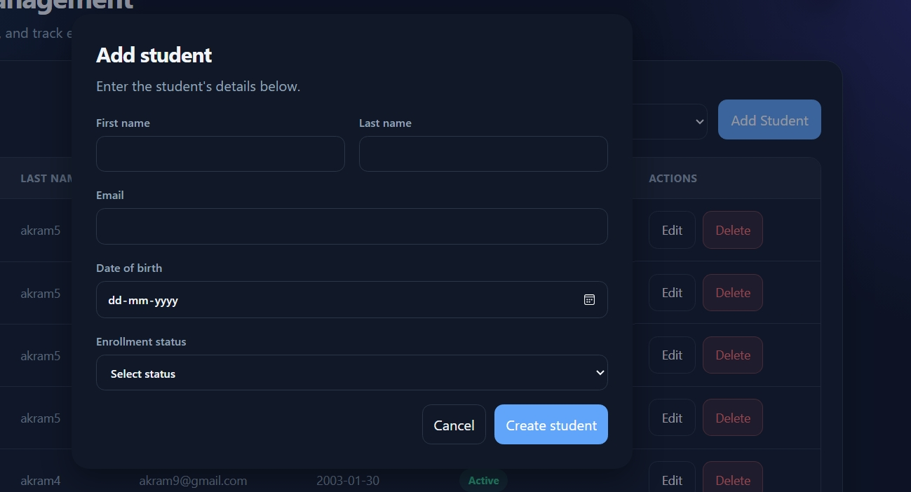
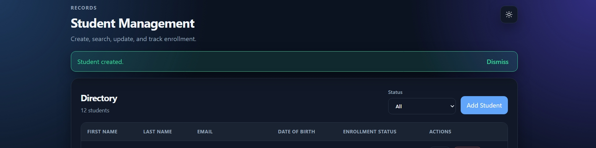
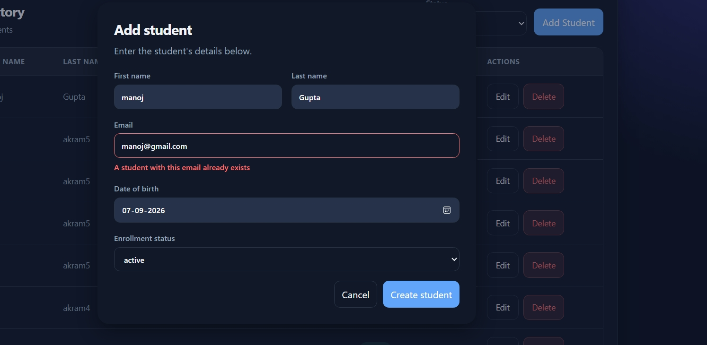
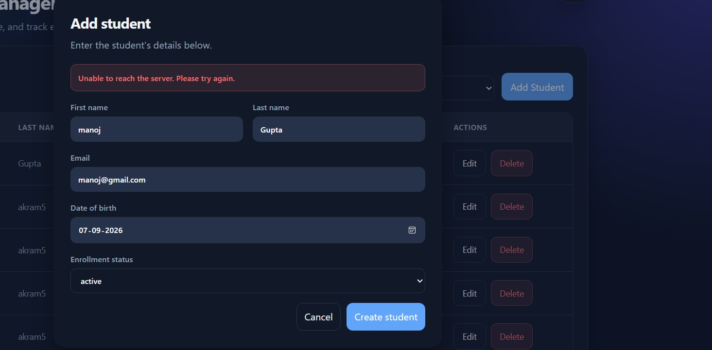

Student Management System

A fullstack CRUD app for managing student records — Flask REST API + SQLite backend, React (Vite) SPA frontend.

## Screenshots

List view with pagination and status filter applied

List view with pagination and status filter applied

Create/edit form

Successful student creation

Validation error — duplicate email shown in the UI

Error state — failed request handled gracefully

Setup & Run

Requirements: Python 3.10+, Node.js 18+, two terminals.

Backend
bash
cd backend
python -m venv venv

Activate it:

macOS/Linux: source venv/bin/activate
Windows: .\venv\Scripts\Activate.ps1 (if blocked: Set-ExecutionPolicy -Scope Process -ExecutionPolicy Bypass first)

Install and run:

bash
pip install -r requirements.txt
python app.py

Runs at http://localhost:5000. SQLite DB (students.db) is created automatically on first run.

Frontend

New terminal:

bash
cd frontend
npm install
npm run dev

Runs at http://localhost:5173 and calls the backend at http://localhost:5000.

Tests
bash
cd backend
python -m pytest tests/ -v

Both servers must be running at the same time for the app to work. Total setup time: under 10 minutes from a clean clone.

Tech Choices

| Layer | Choice | Why |
|---|---|---|
| Backend | Flask | Small surface area, keeps routes/models/tests cleanly separated, quick to build within the assignment's time budget. |
| Database | SQLite + SQLAlchemy | No external DB service needed for a take-home; tables auto-create on first run. |
| Frontend | React + Vite | Vue was preferred by the company (small bonus), but I'm most experienced in React and could build cleaner components and a proper API layer faster in it. The assignment states React is fully acceptable. |
| HTTP client | Axios | Isolated in `src/services/api.js` — components never call Axios directly, keeping API logic separate from UI logic. |
| Tests | pytest + Flask test client | Uses an in-memory SQLite DB so tests never touch the real `students.db`. |

## Known Limitations / What I'd Do Next

**Security**
- No authentication — anyone hitting the API can read/change records. Would add JWT-based auth with role-based access next.

**Data handling**
- Email uniqueness check is case-sensitive (`Asha@test.com` and `asha@test.com` are treated as different).
- Pagination is offset-based — fine at this scale, but would move to keyset pagination for a large dataset.

**UX**
- Delete uses `window.confirm` instead of a proper in-app modal.
- No search-by-name — only status filtering is currently supported.

**Infra / Production readiness**
- SQLite works for local dev; production would use Postgres with Alembic migrations.
- API base URL is hardcoded to `localhost:5000` rather than pulled from an environment variable.

**Testing**
- No frontend automated tests (explicitly a bonus, not required, per the assignment).

AI Usage

Tools used: Cursor (Claude-based agent) for scaffolding the backend/frontend, writing endpoints, building components, and generating tests. I ran, tested, and read every piece of generated code myself — nothing was committed without being verified working.

Here are two real mistakes the AI made, that I only caught by actually running the code:

1. Windows curl commands were silently broken

Cursor generated standard bash-style curl commands to test the API, e.g.:

bash
curl -i -X POST http://localhost:5000/students \
  -H "Content-Type: application/json" \
  -d '{"first_name":"Asha", ...}'

This looks correct, but on Windows PowerShell, the \ line continuation doesn't work the same way — -H and -d were being parsed as separate, invalid commands. Even after escaping quotes, PowerShell was still splitting the JSON body on commas, causing bizarre errors like Port number was not a decimal number.

How I caught it: the backend was clearly running (I could hit it in the browser), but every curl POST failed with a parsing error that had nothing to do with my actual API code — that mismatch is what told me the problem was the command, not my server.

Fix: switched to curl.exe with single-quoted JSON, and documented both Windows and Unix versions in this README so anyone testing the API doesn't hit the same wall.

2. A CSS search-and-replace left invalid, dangling styles

While asking Cursor to swap a hardcoded color (
#f8fafc) for a CSS variable across the stylesheet, it left a property outside of any rule block:

css
.student-list__table th {
  background: #f8fafc;
}

  background: var(--surface-muted);   /* dangling — not inside any selector */

This is invalid CSS — it doesn't throw an error, it just silently gets ignored by the browser, so the visual bug (a stale background color) was easy to miss at a glance.

How I caught it: I made it a habit to actually re-read the file diff after every AI edit, not just trust the "done" message — that's how I spotted the dangling block.

Fix: restored the correct th and tbody tr:hover rules manually.

Takeaway: both of these looked completely fine at a glance — one only broke on a different OS, the other was invalid CSS that failed silently. Neither would've been caught without actually running the code and reading the output, which is why I tested every endpoint and every UI flow manually rather than trusting the AI's first pass.

